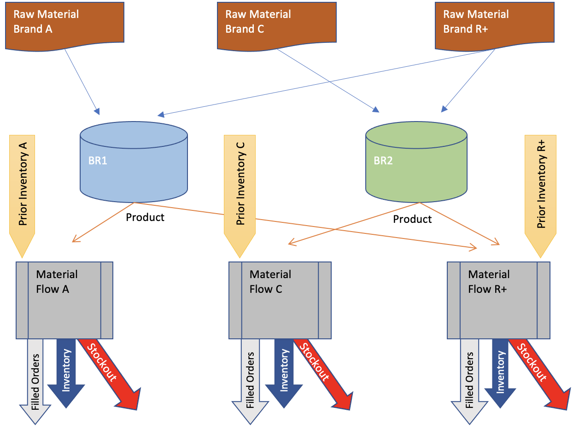
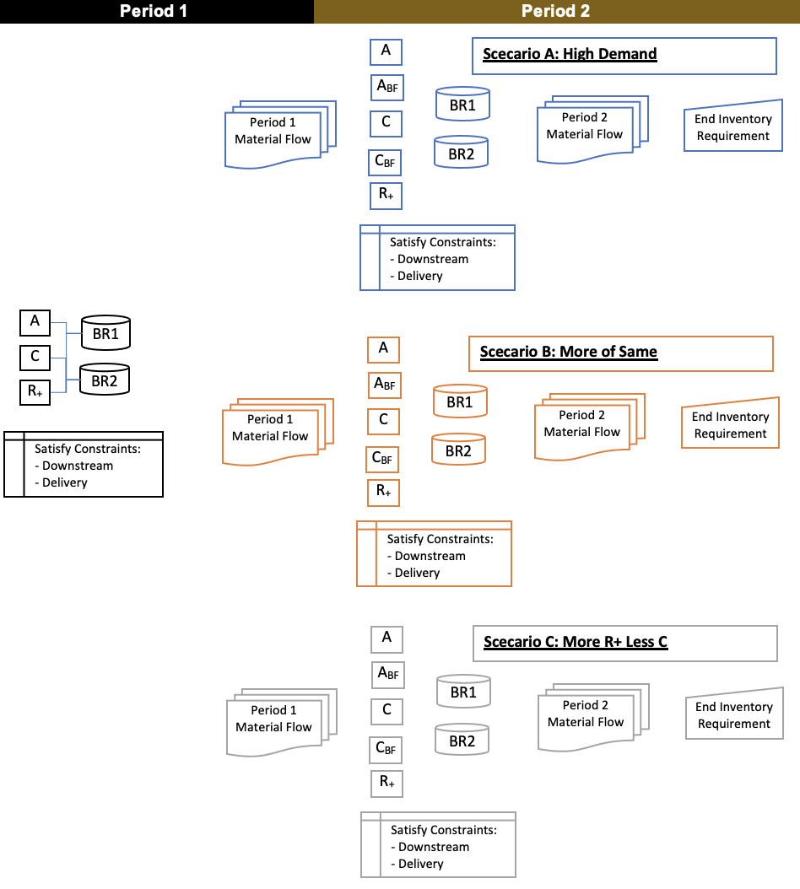

# Bioreactor Optimization Examples

## [Basic Optimization Modeling](BioReactorSingleBatch/build_model.py)
 
- 3 Products
- 2 Bioreactors
- Schedule Production for 1 Period

See Full Model Data in [Data Dictionary](BioReactorSingleBatch/model_data.yml)

## [Stochastic Optimization Modeling](BioReactorTwoBatch/build_model_2stg.py)
**Unknown Demand (3 scenarios)** 
 
Includes Functionality for Bleed Feed Production

- 3 Products
- 2 Bioreactors
- Schedule Production for 2 Periods
- Avoid New Setup Cost in 2nd Period, If Bleed-Feed is Selected

See Full Model Data in [Data Dictionary](BioReactorTwoBatch/model_data_2stg.yml)
